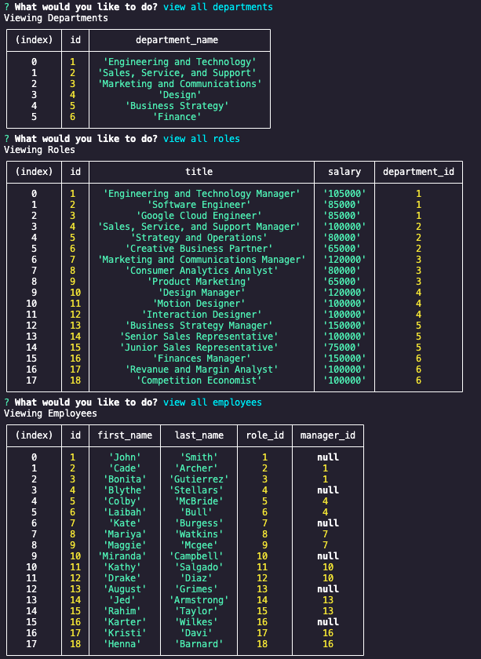

# SQL-employee-tracker

## Description

This application can be used to create a database for employees at a company. The departments, roles, and employees each have their own table storing related information. This application uses SQL to create the data base. This application also uses inquirer to prompt the user with questions that will be used to input information into the database.

### Screenshot of Running Application

### Video Walkthrough

[Walkthrough](https://drive.google.com/file/d/1-NRDs2EaHDY2lpK1iBKFDJzk4ePTDpV1/view?usp=sharing)

## Table of Contents

1.  [Installation Instructions](#installation)
2.  [Usage Information](#usage)
3.  [Contribution Guidelines](#contribution)
4.  [Testing](#testing)
5.  [License information](#Licensing)
6.  [Questions](#questions)

## Installation

Start by cloning this repository onto your device. Next you will need to run `npm i` in your terminal to install the necessary dependencies.

## Usage

In order to start the application, run the command `node server.js`. From here, you will be prompted with questions to answer regarding adding a department, role, or employee to your database. You will also have the option to View all Departments, View all Roles, or View all Employees.

## Contribution

There were no other contributions to this application.

## Testing

This application has no testing.

## Licensing

This application has no license.

## Questions

If you have any further questions,

- You can email me at: kami.gillespie@gmail.com
- You can find my GitHub at: [kamarygillespie4](https://github.com/kamarygillespie4)
